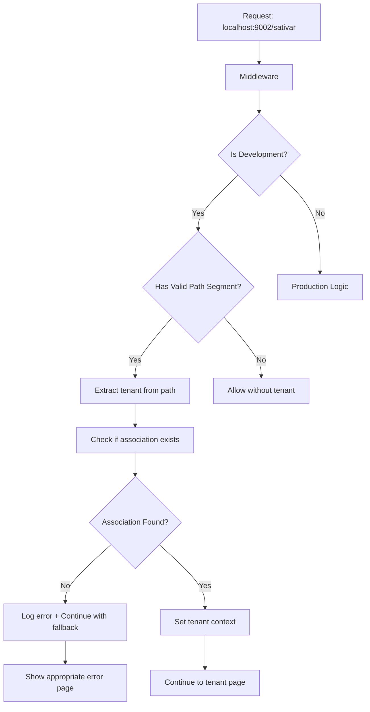

# Design Document

## Overview

O problema identificado é que o middleware multi-tenant está tentando validar tenants em desenvolvimento mesmo quando não deveria, e pode não estar encontrando a associação "sativar" no banco de dados. A solução envolve três componentes principais:

1. **Correção da lógica do middleware** para melhor tratamento de rotas em desenvolvimento
2. **Garantia de dados de teste** adequados no banco de dados
3. **Melhoria do tratamento de erros** para debugging em desenvolvimento

## Architecture

### Current System Flow
```mermaid
graph TD
    A[Request: localhost:9002/sativar] --> B[Middleware]
    B --> C{Extract Subdomain}
    C --> D[getTenantContext]
    D --> E[getAssociationBySubdomain]
    E --> F{Association Found?}
    F -->|No| G[Return null]
    F -->|Yes| H[Return TenantContext]
    G --> I[Show "Association not found"]
    H --> J[Continue to page]
```

### Proposed System Flow


## Components and Interfaces

### 1. Middleware Enhancement

**File:** `middleware.ts`

**Changes needed:**
- Melhorar tratamento de erros em desenvolvimento
- Adicionar logging detalhado para debugging
- Implementar fallback gracioso quando tenant não é encontrado

**New Interface:**
```typescript
interface MiddlewareConfig {
  isDevelopment: boolean;
  allowFallback: boolean;
  debugMode: boolean;
}
```

### 2. Tenant Context Service Enhancement

**File:** `src/lib/middleware/tenant.ts`

**Changes needed:**
- Adicionar logging detalhado para debugging
- Melhorar tratamento de casos edge em desenvolvimento
- Implementar cache local para desenvolvimento

**Enhanced Interface:**
```typescript
interface TenantContextOptions {
  enableFallback?: boolean;
  debugMode?: boolean;
  cacheEnabled?: boolean;
}

export async function getTenantContext(
  request: NextRequest, 
  options?: TenantContextOptions
): Promise<TenantContext | null>
```

### 3. Database Seeding Enhancement

**File:** `scripts/seed-test-association.js`

**Changes needed:**
- Garantir que a associação "sativar" existe e está ativa
- Adicionar verificação de integridade dos dados
- Implementar script de verificação de saúde do banco

**New Functions:**
```javascript
async function ensureTestAssociation()
async function verifyDatabaseHealth()
async function seedDevelopmentData()
```

## Data Models

### Association Model (Existing)
```typescript
interface Association {
  id: string;
  name: string;
  subdomain: string; // "sativar"
  wordpressUrl: string;
  wordpressUrlDev?: string;
  isActive: boolean; // Must be true
  // ... other fields
}
```

### Enhanced Logging Model
```typescript
interface MiddlewareLog {
  timestamp: Date;
  request: {
    url: string;
    host: string;
    pathname: string;
  };
  tenant: {
    extracted: string | null;
    found: boolean;
    associationId?: string;
  };
  action: 'allow' | 'redirect' | 'error';
  error?: string;
}
```

## Error Handling

### Development Error Handling Strategy

1. **Graceful Degradation:** Se o tenant não for encontrado em desenvolvimento, continuar com uma página de erro informativa em vez de quebrar completamente

2. **Detailed Logging:** Adicionar logs detalhados para facilitar debugging:
   ```typescript
   console.log('[DEV] Middleware Debug:', {
     host: request.headers.get('host'),
     pathname: request.nextUrl.pathname,
     extractedTenant: tenantSlug,
     associationFound: !!tenantContext,
     error: error?.message
   });
   ```

3. **Fallback Pages:** Criar páginas específicas para diferentes tipos de erro:
   - `/association-not-found` - Quando tenant não existe
   - `/association-inactive` - Quando tenant existe mas está inativo
   - `/dev-error` - Erros específicos de desenvolvimento

### Production Error Handling

Manter o comportamento atual para produção, apenas melhorando o logging.

## Testing Strategy

### 1. Database Verification Tests
```javascript
// Verify association exists and is active
async function testAssociationExists() {
  const association = await getAssociationBySubdomain('sativar');
  assert(association !== null, 'Association sativar should exist');
  assert(association.isActive === true, 'Association should be active');
}
```

### 2. Middleware Integration Tests
```javascript
// Test middleware behavior with different URLs
const testCases = [
  { url: 'localhost:9002/', shouldHaveTenant: false },
  { url: 'localhost:9002/sativar', shouldHaveTenant: true },
  { url: 'localhost:9002/nonexistent', shouldHaveTenant: false },
  { url: 'localhost:9002/admin', shouldHaveTenant: false }
];
```

### 3. Development Environment Tests
```javascript
// Verify development setup
async function testDevelopmentSetup() {
  // Check if database is accessible
  // Check if seed data exists
  // Check if environment variables are set
}
```

## Implementation Plan

### Phase 1: Database Verification
1. Executar script de seed para garantir dados de teste
2. Verificar se associação "sativar" existe e está ativa
3. Adicionar verificações de integridade

### Phase 2: Middleware Enhancement
1. Adicionar logging detalhado em desenvolvimento
2. Implementar tratamento gracioso de erros
3. Melhorar lógica de extração de tenant

### Phase 3: Error Pages Enhancement
1. Criar páginas de erro mais informativas
2. Adicionar informações de debugging em desenvolvimento
3. Implementar redirecionamentos apropriados

### Phase 4: Testing and Validation
1. Testar todos os cenários de URL
2. Verificar comportamento em desenvolvimento vs produção
3. Validar que Hero Section continua funcionando

## Security Considerations

- Logs detalhados apenas em desenvolvimento
- Não expor informações sensíveis em páginas de erro
- Manter validação de tenant em produção
- Garantir que fallbacks não comprometam segurança

## Performance Considerations

- Cache de associações em desenvolvimento para reduzir queries
- Logging assíncrono para não impactar performance
- Lazy loading de dados de tenant quando possível