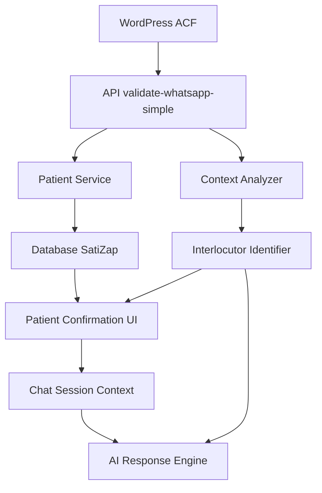
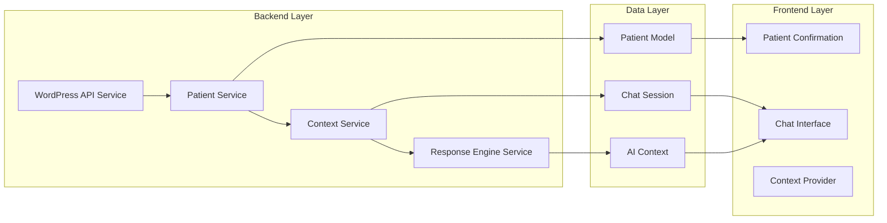

# Design Document

## Overview

O sistema SatiZap implementará uma lógica inteligente de identificação de interlocutor que diferencia automaticamente entre paciente direto e responsável (tutor/familiar) baseado nos dados ACF do WordPress. Esta funcionalidade transformará a experiência do usuário, proporcionando mensagens contextualizadas, interface adaptável e conversas personalizadas com a IA.

A arquitetura seguirá o padrão de fluxo unidirecional de dados, garantindo que as informações fluam corretamente do WordPress → API SatiZap → Banco de Dados → Interface → IA, mantendo a integridade contextual em todas as camadas.

## Architecture

### Data Flow Architecture



### Component Architecture



## Components and Interfaces

### 1. Context Analyzer Service

**Purpose:** Analisa os dados ACF e determina o tipo de interlocutor

```typescript
interface InterlocutorContext {
  scenario: 'patient' | 'responsible';
  interlocutorName: string;
  patientName: string;
  isResponsibleScenario: boolean;
  contextualData: {
    tipo_associacao: string;
    nome_responsavel?: string;
    cpf_responsavel?: string;
  };
}

class ContextAnalyzer {
  analyzeInterlocutor(patientData: Patient): InterlocutorContext;
  generateWelcomeMessage(context: InterlocutorContext): string;
  createChatContext(context: InterlocutorContext): ChatSessionContext;
}
```

### 2. Enhanced Patient Service

**Purpose:** Expandir o serviço existente para incluir lógica de contexto

```typescript
interface EnhancedPatientData extends Patient {
  interlocutorContext?: InterlocutorContext;
  syncMetadata: {
    lastWordPressSync: Date;
    acfFieldsPreserved: boolean;
    syncSource: 'wordpress_acf' | 'satizap' | 'lead_capture';
  };
}

class PatientService {
  // Existing methods enhanced
  syncPatientWithWordPressACF(phone: string, wpData: any, associationId: string): Promise<EnhancedPatientData>;
  
  // New methods
  analyzePatientContext(patient: Patient): InterlocutorContext;
  validateACFDataIntegrity(wpData: any): boolean;
  logSyncDiscrepancies(expected: any, received: any): void;
}
```

### 3. Contextual UI Components

**Purpose:** Componentes React adaptáveis baseados no contexto do interlocutor

```typescript
interface ContextualMessageProps {
  interlocutorContext: InterlocutorContext;
  messageType: 'welcome' | 'confirmation' | 'chat_intro';
  variant?: 'patient' | 'responsible';
}

// Enhanced Patient Confirmation Component
interface PatientConfirmationProps {
  patientData: EnhancedPatientData;
  onConfirm: () => void;
  isLoading?: boolean;
}

// New Contextual Message Component
const ContextualMessage: React.FC<ContextualMessageProps>;
const InterlocutorBadge: React.FC<{ context: InterlocutorContext }>;
const ResponsibleIndicator: React.FC<{ patientName: string; responsibleName: string }>;
```

### 4. AI Context Enhancement

**Purpose:** Enriquecer o contexto da IA com informações de interlocutor

```typescript
interface AIContextData {
  patientProfile: Patient;
  interlocutorContext: InterlocutorContext;
  conversationRules: {
    addressingStyle: 'direct' | 'third_person';
    pronounUsage: 'you' | 'patient_name';
    questionFormulation: 'direct' | 'about_patient';
  };
  messageTemplates: {
    greeting: string;
    symptomInquiry: string;
    orderConfirmation: string;
  };
}

class ResponseEngineService {
  // Enhanced existing method
  generateContextualResponse(
    message: string, 
    patient: Patient, 
    context: InterlocutorContext
  ): Promise<string>;
  
  // New methods
  createAIPromptWithContext(context: AIContextData): string;
  adaptMessageForInterlocutor(message: string, context: InterlocutorContext): string;
}
```

## Data Models

### Enhanced Patient Model

```typescript
// Existing Patient interface enhanced
interface Patient {
  // Existing fields
  id: string;
  name: string;
  whatsapp: string;
  email?: string;
  cpf?: string;
  status: string;
  wordpress_id?: string;
  associationId: string;
  
  // Enhanced ACF fields
  tipo_associacao?: 'assoc_paciente' | 'assoc_respon';
  nome_responsavel?: string;
  cpf_responsavel?: string;
  
  // New context fields
  interlocutorContext?: InterlocutorContext;
  lastContextUpdate?: Date;
  acfSyncStatus?: 'synced' | 'partial' | 'failed';
}
```

### Chat Session Context

```typescript
interface ChatSessionContext {
  sessionId: string;
  patientId: string;
  interlocutorContext: InterlocutorContext;
  conversationState: {
    addressingMode: 'direct' | 'third_person';
    currentSpeaker: string; // interlocutorName
    patientReference: string; // patientName
  };
  aiInstructions: {
    basePrompt: string;
    contextualRules: string[];
    messageTemplates: Record<string, string>;
  };
  createdAt: Date;
  updatedAt: Date;
}
```

### ACF Data Validation Schema

```typescript
interface ACFValidationSchema {
  required: string[];
  optional: string[];
  typeValidation: Record<string, 'string' | 'number' | 'boolean'>;
  contextualFields: {
    patient: string[];
    responsible: string[];
  };
}

const ACF_SCHEMA: ACFValidationSchema = {
  required: ['telefone', 'nome_completo', 'tipo_associacao'],
  optional: ['cpf', 'nome_completo_responc', 'cpf_responsavel'],
  typeValidation: {
    telefone: 'string',
    nome_completo: 'string',
    tipo_associacao: 'string',
    cpf: 'string',
    nome_completo_responc: 'string',
    cpf_responsavel: 'string'
  },
  contextualFields: {
    patient: ['nome_completo', 'cpf'],
    responsible: ['nome_completo_responc', 'cpf_responsavel']
  }
};
```

## Error Handling

### ACF Data Sync Error Handling

```typescript
interface SyncError {
  type: 'missing_acf' | 'invalid_format' | 'partial_data' | 'context_mismatch';
  message: string;
  expectedData: any;
  receivedData: any;
  recoveryAction: 'retry' | 'fallback' | 'manual_review';
  timestamp: Date;
}

class ACFSyncErrorHandler {
  handleMissingACF(wpData: any): SyncError;
  handlePartialData(expected: any, received: any): SyncError;
  logSyncDiscrepancy(error: SyncError): void;
  attemptDataRecovery(error: SyncError): Promise<boolean>;
}
```

### Context Resolution Fallbacks

```typescript
interface ContextFallback {
  scenario: 'unknown_association_type' | 'missing_responsible_data' | 'ambiguous_context';
  fallbackStrategy: 'assume_patient' | 'request_clarification' | 'use_default';
  userMessage: string;
  logLevel: 'warning' | 'error';
}

const CONTEXT_FALLBACKS: Record<string, ContextFallback> = {
  unknown_association_type: {
    scenario: 'unknown_association_type',
    fallbackStrategy: 'assume_patient',
    userMessage: 'Bem-vindo(a) de volta!',
    logLevel: 'warning'
  },
  missing_responsible_data: {
    scenario: 'missing_responsible_data',
    fallbackStrategy: 'use_default',
    userMessage: 'Bem-vindo(a) ao atendimento!',
    logLevel: 'error'
  }
};
```

## Testing Strategy

### Unit Testing

```typescript
// Context Analyzer Tests
describe('ContextAnalyzer', () => {
  test('should identify patient scenario correctly');
  test('should identify responsible scenario correctly');
  test('should handle missing ACF data gracefully');
  test('should generate appropriate welcome messages');
});

// Patient Service Tests
describe('PatientService', () => {
  test('should preserve ACF data during sync');
  test('should handle WordPress API failures');
  test('should validate data integrity');
  test('should log sync discrepancies');
});

// UI Component Tests
describe('PatientConfirmation', () => {
  test('should display patient scenario correctly');
  test('should display responsible scenario correctly');
  test('should show contextual badges and indicators');
  test('should handle loading states');
});
```

### Integration Testing

```typescript
// End-to-End Context Flow Tests
describe('Interlocutor Context Flow', () => {
  test('should handle complete patient flow');
  test('should handle complete responsible flow');
  test('should maintain context through chat session');
  test('should sync data correctly with WordPress');
});

// API Integration Tests
describe('API Integration', () => {
  test('should validate WhatsApp with ACF context');
  test('should handle WordPress API responses');
  test('should create appropriate chat contexts');
  test('should generate contextual AI responses');
});
```

### User Acceptance Testing Scenarios

```typescript
interface TestScenario {
  name: string;
  setup: string;
  expectedBehavior: string;
  acceptanceCriteria: string[];
}

const UAT_SCENARIOS: TestScenario[] = [
  {
    name: 'Patient Direct Access',
    setup: 'Patient Lucas calls directly using his phone',
    expectedBehavior: 'System recognizes Lucas as the patient',
    acceptanceCriteria: [
      'Welcome message: "Bem-vindo(a) de volta, Lucas!"',
      'AI addresses Lucas directly with "você"',
      'Chat context shows patient scenario'
    ]
  },
  {
    name: 'Responsible Access',
    setup: 'Carolina calls using Lucas phone (she is his responsible)',
    expectedBehavior: 'System recognizes Carolina as responsible for Lucas',
    acceptanceCriteria: [
      'Welcome message: "Olá, Carolina! Você está iniciando o atendimento para Lucas."',
      'AI addresses Carolina but references Lucas in third person',
      'Chat context shows responsible scenario'
    ]
  }
];
```

## Performance Considerations

### Caching Strategy

```typescript
interface ContextCache {
  patientId: string;
  interlocutorContext: InterlocutorContext;
  cachedAt: Date;
  ttl: number; // Time to live in seconds
}

class ContextCacheManager {
  cacheContext(patientId: string, context: InterlocutorContext): void;
  getCachedContext(patientId: string): InterlocutorContext | null;
  invalidateCache(patientId: string): void;
  cleanExpiredCache(): void;
}
```

### Database Optimization

```sql
-- Indexes for improved query performance
CREATE INDEX idx_patient_whatsapp_association ON Patient(whatsapp, associationId);
CREATE INDEX idx_patient_tipo_associacao ON Patient(tipo_associacao);
CREATE INDEX idx_patient_wordpress_sync ON Patient(wordpress_id, updatedAt);

-- Composite index for context queries
CREATE INDEX idx_patient_context_lookup ON Patient(whatsapp, associationId, tipo_associacao);
```

## Security Considerations

### Data Privacy

```typescript
interface PrivacyConfig {
  logSensitiveData: boolean;
  maskCPF: boolean;
  maskPhone: boolean;
  retentionPeriod: number; // days
}

class PrivacyManager {
  maskSensitiveData(data: any): any;
  validateDataAccess(userId: string, patientId: string): boolean;
  auditDataAccess(action: string, userId: string, patientId: string): void;
}
```

### Input Validation

```typescript
class InputValidator {
  validateACFData(data: any): ValidationResult;
  sanitizeContextData(context: InterlocutorContext): InterlocutorContext;
  validateInterlocutorPermissions(phone: string, patientId: string): boolean;
}
```

## Migration Strategy

### Database Migration

```sql
-- Add new columns to existing Patient table
ALTER TABLE Patient ADD COLUMN tipo_associacao VARCHAR(20);
ALTER TABLE Patient ADD COLUMN nome_responsavel VARCHAR(255);
ALTER TABLE Patient ADD COLUMN cpf_responsavel VARCHAR(11);
ALTER TABLE Patient ADD COLUMN acf_sync_status VARCHAR(20) DEFAULT 'pending';
ALTER TABLE Patient ADD COLUMN last_context_update TIMESTAMP;

-- Create indexes
CREATE INDEX idx_patient_tipo_associacao ON Patient(tipo_associacao);
CREATE INDEX idx_patient_context_update ON Patient(last_context_update);
```

### Data Backfill Strategy

```typescript
class MigrationService {
  async backfillExistingPatients(): Promise<void> {
    // 1. Identify patients without context data
    // 2. Fetch ACF data from WordPress
    // 3. Update patient records with context
    // 4. Validate data integrity
    // 5. Log migration results
  }
  
  async validateMigration(): Promise<MigrationReport> {
    // Validate that all patients have proper context data
  }
}
```

## Monitoring and Observability

### Metrics to Track

```typescript
interface ContextMetrics {
  totalPatientScenarios: number;
  totalResponsibleScenarios: number;
  acfSyncSuccessRate: number;
  contextResolutionFailures: number;
  averageContextResolutionTime: number;
  chatSessionsWithContext: number;
}

class ContextMonitoring {
  trackScenarioDistribution(): void;
  monitorSyncHealth(): void;
  alertOnContextFailures(): void;
  generateContextReport(): ContextMetrics;
}
```

### Logging Strategy

```typescript
interface ContextLog {
  timestamp: Date;
  level: 'info' | 'warning' | 'error';
  event: string;
  patientId?: string;
  context?: InterlocutorContext;
  metadata: Record<string, any>;
}

class ContextLogger {
  logContextResolution(patientId: string, context: InterlocutorContext): void;
  logSyncDiscrepancy(expected: any, received: any): void;
  logContextFailure(error: Error, patientId: string): void;
}
```