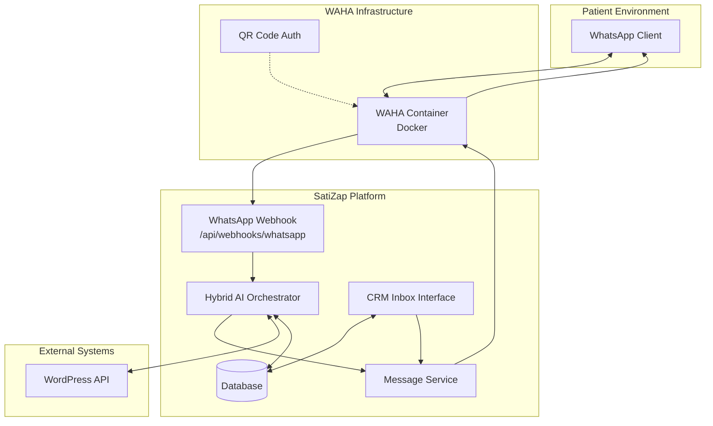
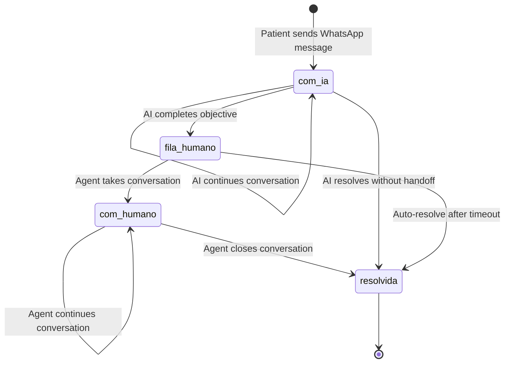
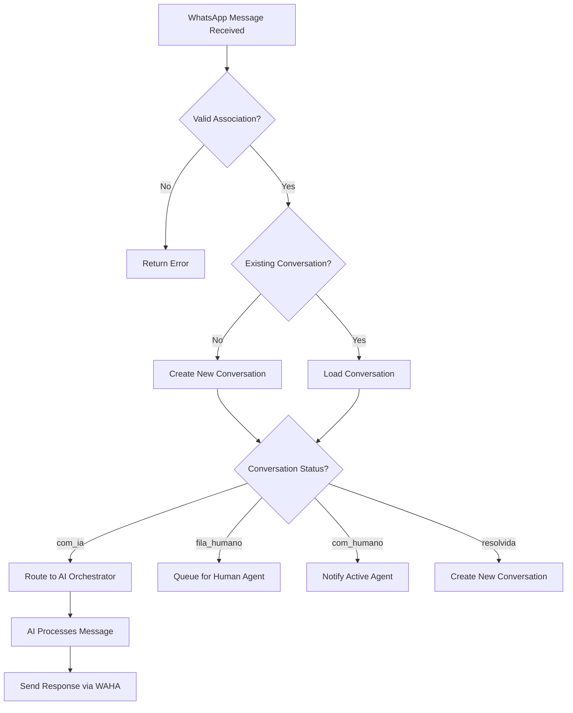

# Design Document

## Overview

The WhatsApp integration transforms SatiZap from a web-based chat platform to a native WhatsApp experience using WAHA (WhatsApp HTTP API) as the communication bridge. The design maintains the existing AI orchestration architecture while adding WhatsApp-specific components for message routing, delivery, and human handoff management.

The solution follows a microservices-like approach where WAHA acts as an external service that translates WhatsApp events into HTTP requests that SatiZap can process, and vice versa for outbound messages.

## Architecture

### High-Level Architecture Diagram



### Component Interaction Flow

1. **Inbound Flow**: WhatsApp → WAHA → SatiZap Webhook → AI Orchestrator → Database
2. **Outbound Flow**: AI/CRM → Message Service → WAHA → WhatsApp
3. **Handoff Flow**: AI → Database State Update → CRM Notification

## Components and Interfaces

### 1. WAHA Infrastructure Component

**Purpose**: Bridge between WhatsApp Business API and SatiZap platform

**Configuration**:
- Docker container running WAHA service
- Environment variables for API keys and webhook URLs
- QR code authentication for WhatsApp Business number
- Health monitoring and auto-restart capabilities

**API Endpoints Exposed**:
- `POST /api/sendText` - Send text messages
- `POST /api/sendImage` - Send image messages
- `GET /api/sessions` - Check session status
- `GET /api/health` - Health check

**Webhook Events Sent to SatiZap**:
```typescript
interface WAHAWebhookPayload {
  event: 'message' | 'message.ack' | 'session.status';
  session: string;
  payload: {
    id: string;
    from: string;
    to: string;
    body?: string;
    type: 'text' | 'image' | 'document';
    timestamp: number;
    mediaUrl?: string;
  };
}
```

### 2. WhatsApp Webhook Handler

**Location**: `/src/app/api/webhooks/whatsapp/route.ts`

**Responsibilities**:
- Receive and validate WAHA webhook payloads
- Extract sender information and message content
- Route messages to appropriate association based on receiving number
- Trigger AI orchestrator with WhatsApp context
- Handle message acknowledgments and delivery status

**Interface**:
```typescript
interface WhatsAppWebhookRequest {
  method: 'POST';
  body: WAHAWebhookPayload;
  headers: {
    'x-waha-signature'?: string; // For webhook verification
  };
}

interface WhatsAppWebhookResponse {
  status: 'success' | 'error';
  message?: string;
  conversationId?: string;
}
```

**Processing Logic**:
1. Validate webhook signature (if configured)
2. Extract phone number and normalize format
3. Determine association from receiving WhatsApp number
4. Validate patient against WordPress API
5. Create or retrieve conversation session
6. Pass message to Hybrid AI Orchestrator with WhatsApp context

### 3. WhatsApp Message Service

**Location**: `/src/lib/services/whatsapp.service.ts`

**Purpose**: Handle outbound message delivery to WhatsApp via WAHA

**Interface**:
```typescript
interface WhatsAppService {
  sendTextMessage(params: SendTextParams): Promise<SendMessageResult>;
  sendImageMessage(params: SendImageParams): Promise<SendMessageResult>;
  sendDocumentMessage(params: SendDocumentParams): Promise<SendMessageResult>;
  getSessionStatus(associationId: string): Promise<SessionStatus>;
}

interface SendTextParams {
  associationId: string;
  to: string; // Phone number
  message: string;
  conversationId?: string;
}

interface SendMessageResult {
  success: boolean;
  messageId?: string;
  error?: string;
  retryAfter?: number;
}
```

**Configuration Management**:
- Retrieve WAHA API URL and key from Association model
- Handle multiple WAHA instances for different associations
- Implement retry logic for failed deliveries
- Rate limiting and queue management

### 4. Enhanced Association Model

**Database Schema Extensions**:
```sql
ALTER TABLE Association ADD COLUMN waha_api_url VARCHAR(255);
ALTER TABLE Association ADD COLUMN waha_api_key VARCHAR(255);
ALTER TABLE Association ADD COLUMN whatsapp_number VARCHAR(20);
ALTER TABLE Association ADD COLUMN waha_session_name VARCHAR(100);
```

**Prisma Model Update**:
```typescript
model Association {
  // ... existing fields
  wahaApiUrl      String?
  wahaApiKey      String?
  whatsappNumber  String?
  wahaSessionName String?
}
```

### 5. Conversation Model Enhancements

**WhatsApp-Specific Fields**:
```sql
ALTER TABLE Conversation ADD COLUMN channel ENUM('web', 'whatsapp') DEFAULT 'web';
ALTER TABLE Conversation ADD COLUMN whatsapp_session_id VARCHAR(100);
ALTER TABLE Conversation ADD COLUMN last_whatsapp_message_id VARCHAR(100);
```

**Updated Conversation States**:
- `com_ia` - AI handling the conversation
- `fila_humano` - Queued for human agent (NEW)
- `com_humano` - Active with human agent
- `resolvida` - Conversation completed

### 6. Message Model Enhancements

**WhatsApp Message Metadata**:
```typescript
interface WhatsAppMessageMetadata {
  wahaMessageId?: string;
  deliveryStatus?: 'sent' | 'delivered' | 'read' | 'failed';
  mediaUrl?: string;
  mediaType?: 'image' | 'document' | 'audio';
  retryCount?: number;
}
```

### 7. AI Orchestrator Adaptations

**WhatsApp Context Integration**:
```typescript
interface WhatsAppAIInput extends HybridAIInput {
  channel: 'whatsapp';
  wahaSessionId: string;
  messageMetadata?: WhatsAppMessageMetadata;
}
```

**Response Delivery Modification**:
- Replace web response rendering with WhatsApp message service calls
- Handle media attachments (images, documents) in responses
- Implement message chunking for long responses
- Add WhatsApp-specific formatting (no HTML, limited markdown)

**Handoff Logic**:
```typescript
async function initiateHandoff(conversationId: string): Promise<void> {
  // Update conversation status
  await updateConversationState(conversationId, HybridConversationState.FILA_HUMANO);
  
  // Send transition message to patient
  await whatsappService.sendTextMessage({
    associationId: conversation.patient.associationId,
    to: conversation.patient.whatsapp,
    message: "Obrigado pelas informações! Um atendente especializado entrará em contato em breve para finalizar seu pedido.",
    conversationId
  });
  
  // Notify CRM (via WebSocket or database flag)
  await notifyCRMNewConversation(conversationId);
}
```

### 8. CRM Inbox Interface

**Location**: `/src/app/dashboard/[subdomain]/inbox/page.tsx`

**Components**:
- **ConversationList**: Display conversations awaiting human attention
- **ConversationView**: Show message history and patient context
- **MessageComposer**: Send messages to patients via WhatsApp
- **PatientProfile**: Display patient information and order history

**Real-time Updates**:
- WebSocket connection for new message notifications
- Auto-refresh conversation list when status changes
- Typing indicators and message delivery status

**Interface Design**:
```typescript
interface InboxPageProps {
  conversations: ConversationWithMessages[];
  activeConversation?: string;
}

interface ConversationWithMessages {
  id: string;
  patient: Patient;
  status: Conversation_status;
  lastMessage: Message;
  unreadCount: number;
  messages: Message[];
  orderSummary?: OrderSummary;
}
```

## Data Models

### Enhanced Conversation Flow



### Message Routing Logic



## Error Handling

### WAHA Connection Failures
- Implement circuit breaker pattern for WAHA API calls
- Fallback to error messages when WAHA is unavailable
- Queue messages for retry when connection is restored
- Health check endpoints to monitor WAHA status

### Message Delivery Failures
- Exponential backoff retry strategy
- Dead letter queue for permanently failed messages
- Notification system for administrators when delivery fails
- Graceful degradation to alternative communication channels

### Association Configuration Errors
- Validation of WAHA credentials during configuration
- Test connection functionality in admin interface
- Clear error messages for misconfigured associations
- Fallback to default WAHA instance if association-specific fails

## Testing Strategy

### Unit Tests
- WhatsApp webhook payload parsing and validation
- Message service API calls and error handling
- AI orchestrator WhatsApp context processing
- Conversation state transitions and handoff logic

### Integration Tests
- End-to-end message flow from WhatsApp to AI response
- WAHA API integration with different message types
- Database operations for WhatsApp-specific data
- CRM interface functionality with real conversation data

### Load Testing
- Concurrent WhatsApp message processing
- WAHA API rate limiting and queue management
- Database performance with increased message volume
- WebSocket connection stability for CRM real-time updates

### User Acceptance Testing
- Patient experience sending messages via WhatsApp
- Agent workflow for managing conversations in CRM
- Association administrator configuration process
- Message delivery reliability and timing

## Security Considerations

### Webhook Security
- HMAC signature verification for WAHA webhooks
- Rate limiting on webhook endpoints
- Input validation and sanitization
- HTTPS enforcement for all webhook communications

### Data Privacy
- Encryption of WhatsApp message content in database
- Secure storage of WAHA API credentials
- Patient data access controls in CRM interface
- Audit logging for all message handling operations

### Authentication & Authorization
- Association-based message routing validation
- Agent permissions for accessing conversations
- API key management for WAHA instances
- Session management for CRM interface users

## Performance Optimization

### Message Processing
- Asynchronous message handling to prevent blocking
- Message queuing for high-volume scenarios
- Caching of frequently accessed patient data
- Database indexing for conversation and message queries

### WAHA Communication
- Connection pooling for WAHA API calls
- Request batching where supported by WAHA
- Monitoring and alerting for API response times
- Graceful handling of WAHA rate limits

### CRM Interface
- Pagination for conversation lists
- Lazy loading of message history
- WebSocket optimization for real-time updates
- Client-side caching of conversation data